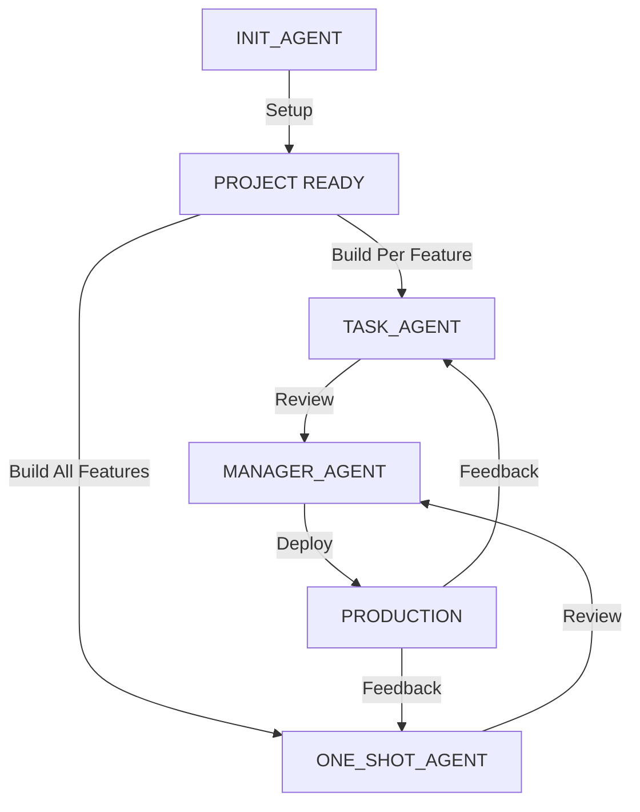

# AI Development

Build complete applications using AI — no coding experience required!

## Overview

Laju is designed from the ground up for AI-assisted development. The standardized structure allows LLMs to understand, navigate, and build features automatically.

## The 4-Agent Workflow


```mermaid
graph TD
    A[INIT_AGENT] -->|Setup| B[PROJECT READY]
    B -->|Build Per Feature| C[TASK_AGENT]
    B -->|Build All Features| F[ONE_SHOT_AGENT]
    C -->|Review| D[MANAGER_AGENT]
    F -->|Review| D
    D -->|Deploy| E[PRODUCTION]
    E -->|Feedback| C
    E -->|Feedback| F
```

### Agent Selection Guide

| Project Size | Recommendation | Why |
|-------------|----------------|-----|
| Small (< 10 features) | **ONE_SHOT_AGENT** | Fast, single session, auto-commit |
| Medium (10-20 features) | **ONE_SHOT_AGENT** or **TASK_AGENT** | Choose based on review needs |
| Large (20+ features) | **TASK_AGENT** | Better control, review per feature |

### 1. INIT_AGENT — Project Setup

**When to use:** Starting a new project

**How to activate:**
```
@workflow/INIT_AGENT.md

"I want to build [your app description]"
```

**What it does:**
- Creates README.md with project overview
- Creates PRD.md (Product Requirements Document)
- Creates TDD.md (Technical Design Document)
- Creates PROGRESS.md (Development tracking)
- Creates ui-kit.html (Design system)
- Sets up Tailwind config with branding colors
- Creates database migrations
- Runs migrations
- Initializes git repository

**Example:**
```
@workflow/INIT_AGENT.md

I want to build a task management app where:
- Users can create projects with name and description
- Each project has tasks with status (todo, doing, done)
- Tasks can be assigned to team members
- Users can add comments to tasks
- Dashboard shows all tasks grouped by status
- Clean, modern design with purple accents
```

### 2. TASK_AGENT — Feature Implementation (Per Feature)

**When to use:** Building features one at a time, large projects, need review per feature

**How to activate:**
```
@workflow/TASK_AGENT.md

"Create [feature description]"
```

**What it does:**
- Creates/modifies controllers
- Creates/modifies Svelte pages
- Adds routes
- Creates database queries
- Implements business logic
- Waits for user review before continuing

**Example:**
```
@workflow/TASK_AGENT.md

Create the project dashboard page showing:
- List of all projects with progress bars
- "New Project" button
- Quick stats (total tasks, completed, pending)
- Filter by status dropdown
```

### 3. ONE_SHOT_AGENT — Feature Implementation (All at Once)

**When to use:** Small to medium projects, clear requirements, want everything built in one session

**How to activate:**
```
@workflow/ONE_SHOT_AGENT.md

"Build all features from PROGRESS.md"
```

**What it does:**
- Reads all pending tasks from PROGRESS.md
- Implements ALL features sequentially (one by one)
- Auto-commits after each feature completes
- Updates PROGRESS.md automatically
- Continues until ALL features are done
- Shows progress summary after each feature

**Example:**
```
@workflow/ONE_SHOT_AGENT.md

Please implement all features from PROGRESS.md:
- User management system
- Product catalog with categories
- Order management
- Payment integration
- Dashboard analytics
```

**Key Differences from TASK_AGENT:**

| Aspect | TASK_AGENT | ONE_SHOT_AGENT |
|--------|-----------|----------------|
| Execution | Per feature (concurrent) | All features (sequential) |
| Session | Multiple tabs/sessions | Single session |
| User Review | After each feature | At the end |
| Commit | Manual or on confirmation | Auto per feature |
| Best For | Large projects, complex features | Small-medium projects, standard CRUD |

### 4. MANAGER_AGENT — Review & Deployment

**When to use:** Code review, deployment approval, release notes

**How to activate:**
```
@workflow/MANAGER_AGENT.md

"Review code quality and create release notes"
```

**What it does:**
- Reviews code quality
- Checks test coverage
- Approves deployment
- Creates release notes
- Updates changelog

## Best Practices

### Be Specific

❌ **Vague:**
```
"Make a blog"
```

✅ **Specific:**
```
"Create a blog system with:
- Posts with title, content, tags, and featured image
- Categories for organizing posts  
- Comments (requires login)
- Pagination on index page
- Search functionality
- Clean design with blue accents"
```

### Describe Business Logic

❌ **Technical:**
```
"Create posts table with foreign key to users"
```

✅ **Business:**
```
"When a user creates a post, it should show up on the homepage. 
Only the author can edit or delete their own posts."
```

### Step-by-Step Workflow with TASK_AGENT

1. **Start with INIT_AGENT** — Don't skip project setup
2. **Review documentation** — Check PRD.md, TDD.md before building
3. **Build one feature at a time** — Easier to review and fix
4. **Test before continuing** — Open browser, try the feature
5. **Update PROGRESS.md** — Mark completed tasks

### One-Shot Workflow with ONE_SHOT_AGENT

1. **Start with INIT_AGENT** — Setup project as usual
2. **Review PROGRESS.md** — Ensure all features are defined
3. **Activate ONE_SHOT_AGENT** — Let it build everything
4. **Wait for completion** — Agent will show progress updates
5. **Final review** — Test all features at once
6. **Push to GitHub** — All commits are ready

### Use Clear Language

```
"Show a form asking for project name and description"
"After saving, redirect to the project detail page"
"Display an error message if name is empty"
```

## Common Patterns

### Creating a CRUD Feature

**Option A: Using TASK_AGENT (Step by Step)**

**Step 1:** Describe the feature
```
@workflow/TASK_AGENT.md

"Create a complete CRUD for Projects with:
- List all projects (index page)
- Create new project form
- Edit project form
- Delete project with confirmation
- All pages use the DashboardLayout"
```

**Step 2:** Review the generated files
- Check `app/controllers/ProjectController.ts`
- Check `resources/js/Pages/projects/index.svelte`
- Check `resources/js/Pages/projects/form.svelte`
- Check `routes/web.ts`

**Step 3:** Test and give feedback
```
"The create form works, but please add:
- Validation for empty name
- Max length 100 characters for description"
```

**Option B: Using ONE_SHOT_AGENT (All at Once)**

```
@workflow/ONE_SHOT_AGENT.md

"Implement all remaining features from PROGRESS.md:
- Projects CRUD
- Tasks management
- Team members
- Activity logs
- Settings page"
```

### Adding Authentication

```
@workflow/INIT_AGENT.md

"Setup authentication with:
- Email/password login
- Google OAuth
- Password reset via email
- Email verification for new accounts
- Protected routes middleware"
```

### File Upload

```
@workflow/TASK_AGENT.md

"Add avatar upload to user profile:
- Upload to S3 with presigned URL
- Show preview before upload
- Validate image type (jpg, png, webp)
- Max size 2MB
- Store URL in users table"
```

## Tips for Better Results

### 1. Always Mention Workflows

```
❌ "Create a login page"

✅ "@workflow/TASK_AGENT.md
Create a login page"
```

The `@mention` loads context and conventions.

### 2. Reference Existing Code

```
"Create a blog controller similar to the existing PostController,
but with categories and tags"
```

### 3. Specify File Locations

```
"Create the controller in app/controllers/BlogController.ts
Create the page in resources/js/Pages/blog/index.svelte"
```

### 4. Describe Expected Behavior

```
"When user clicks 'Save', show loading spinner.
If successful, redirect to posts list with success message.
If error, show error message on the form."
```

### 5. Include Design Details

```
"Use purple-600 as primary color
Cards should have rounded-xl corners
Show skeleton loading state while data loads"
```

## Workflow Files Reference

| File | Purpose | When to Use |
|------|---------|-------------|
| `workflow/INIT_AGENT.md` | Project initialization | Starting new projects |
| `workflow/TASK_AGENT.md` | Feature implementation (per feature) | Large projects, need review |
| `workflow/ONE_SHOT_AGENT.md` | Feature implementation (all at once) | Small-medium projects |
| `workflow/MANAGER_AGENT.md` | Review & deployment | Code review, releases |
| `workflow/PROGRESS.md` | Development tracking | Track what's built |
| `workflow/PRD.md` | Product requirements | Reference requirements |
| `workflow/TDD.md` | Technical design | Reference technical specs |
| `workflow/ui-kit.html` | Design system | Reference UI components |

## GitHub Actions Integration

The AI workflow integrates seamlessly with GitHub Actions:

1. **Push to GitHub** — Triggers automated testing
2. **Tests Pass** — Auto-deploys to production
3. **Tests Fail** — Deployment blocked, AI fixes issues
4. **Smoke Tests** — Post-deployment verification
5. **Auto-Rollback** — If smoke tests fail

## Troubleshooting AI Issues

### AI Not Following Conventions

**Solution:** Always start with `@workflow/INIT_AGENT.md`, `@workflow/TASK_AGENT.md`, or `@workflow/ONE_SHOT_AGENT.md`

### AI Creates Wrong File Structure

**Solution:** Be specific about file paths:
```
"Create in app/controllers/BlogController.ts"
```

### AI Uses Wrong Syntax

**Solution:** Remind AI:
```
"Remember: Laju controllers don't use 'this'.
Use: export default ControllerName"
```

### AI Hallucinates Features

**Solution:** Check `workflow/PROGRESS.md` to see what's actually built

## Real-World Examples

### Example 1: Small Project with ONE_SHOT_AGENT

```
@workflow/INIT_AGENT.md

"Build a simple contact management app:
- Contacts with name, email, phone, company
- CRUD operations
- Search and filter
- Export to CSV"
```

Then:
```
@workflow/ONE_SHOT_AGENT.md

"Implement all features from PROGRESS.md"
```

### Example 2: E-commerce App with TASK_AGENT

```
@workflow/INIT_AGENT.md

"Build an e-commerce app with:
- Product catalog with categories
- Shopping cart
- Checkout with Stripe
- Order history
- Admin dashboard for products"
```

Then build feature by feature:
```
@workflow/TASK_AGENT.md
"Create product catalog with categories"
```
```
@workflow/TASK_AGENT.md
"Create shopping cart functionality"
```
```
@workflow/TASK_AGENT.md
"Create checkout with Stripe integration"
```

### Example 3: SaaS Dashboard

```
@workflow/INIT_AGENT.md

"Create a SaaS analytics dashboard:
- User authentication with teams
- Connect data sources (Stripe, Google Analytics)
- Show charts and metrics
- Export reports as PDF
- Billing with subscription plans"
```

### Example 4: Social Platform

```
@workflow/INIT_AGENT.md

"Build a community platform:
- User profiles with avatars
- Posts with likes and comments
- Real-time notifications
- Follow/unfollow users
- Feed algorithm (chronological + trending)"
```

## Next Steps

- [Project Structure](./project-structure) — Understand the layout
- [Controllers](./controllers) — Learn controller patterns
- [Database](./database) — Master Kysely queries
- [Authentication](./authentication) — Add user management
