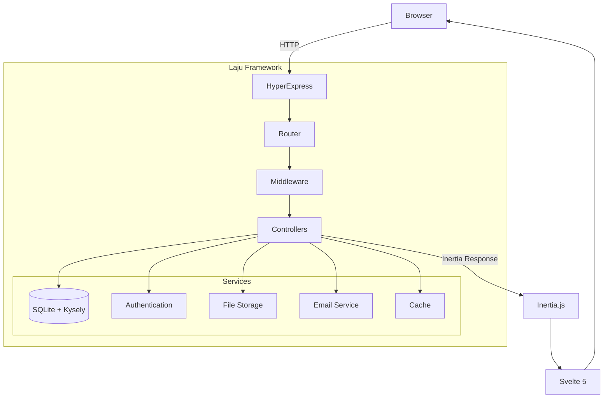

# Introduction

## What is Laju?

**Laju** (Indonesian for 'fast/swift') is a high-performance TypeScript web framework that combines the best of modern web technologies to deliver exceptional speed and developer experience.

## Philosophy

Laju follows these principles:

1. **Performance First** — Every decision optimized for speed
2. **Developer Experience** — Modern tools, hot reload, TypeScript
3. **Batteries Included** — Auth, email, storage out of the box
4. **Simple & Elegant** — Clean architecture, easy to understand
5. **Production Ready** — Battle-tested components, proper error handling
6. **AI-Native** — Built for AI-assisted development

## Tech Stack

| Layer | Technology | Purpose |
|-------|-----------|---------|
| Server | [HyperExpress](https://github.com/kartikk221/hyper-express) | Ultra-fast HTTP server (258k req/s) |
| Frontend | [Svelte 5](https://svelte.dev) | Modern reactive UI framework |
| Bridge | [Inertia.js](https://inertiajs.com) | Seamless client-server communication |
| Database | [BetterSQLite3](https://github.com/WiseLibs/better-sqlite3) | High-performance embedded database |
| Query Builder | [Kysely](https://kysely.dev) | Type-safe SQL query builder |
| Styling | [TailwindCSS](https://tailwindcss.com) | Utility-first CSS framework |
| Build Tool | [Vite](https://vitejs.dev) | Lightning-fast builds |
| Language | [TypeScript](https://typescriptlang.org) | Type-safe development |

## Performance

### HTTP Server

| Framework | Requests/sec | Avg Latency | vs Laju |
|-----------|-------------|-------------|---------|
| **Laju** | **258,611** | **1.52ms** | **Baseline** |
| Pure Node.js | 124,024 | 3.62ms | 2.08x slower |
| Express.js | 22,590 | 26.36ms | 11.45x slower |
| Laravel | 80 | 128.72ms | 3,232x slower |

### Database (WAL Mode)

| Operation | Default | WAL Mode | Improvement |
|-----------|---------|----------|-------------|
| Single Insert | 4,678 ops/s | 93,287 ops/s | **19.9x faster** |
| Batch Insert | 2,895 ops/s | 8,542 ops/s | **2.95x faster** |
| Concurrent Writes | 89 ops/s | 1,302 ops/s | **14.6x faster** |

## Architecture



```
┌─────────────────────────────────────────┐
│           CLIENT (Browser)              │
│    Svelte 5 + Inertia.js + TailwindCSS  │
└─────────────────────────────────────────┘
                    ↕
┌─────────────────────────────────────────┐
│           SERVER (Node.js)              │
│       HyperExpress + TypeScript         │
├─────────────────────────────────────────┤
│   Controllers → Services → Database     │
└─────────────────────────────────────────┘
                    ↕
┌─────────────────────────────────────────┐
│            DATA LAYER                   │
│    BetterSQLite3 (WAL) + Redis (Opt)    │
└─────────────────────────────────────────┘
```

## Key Features

### ⚡ Exceptional Performance
- 2.08x faster than pure Node.js
- 11.45x faster than Express.js
- 258,611 requests/second throughput

### 🤖 AI-Native Architecture
- Standardized structure for AI understanding
- 3-agent workflow (INIT, TASK, MANAGER)
- Built-in documentation patterns

### 🔒 Built-in Authentication
- PBKDF2 password hashing (100,000 iterations)
- Session-based authentication
- Google OAuth integration
- Password reset functionality
- Email verification

### 🗄️ High-Performance Database
- BetterSQLite3 with WAL mode
- Kysely type-safe query builder
- Native SQLite for maximum performance
- Database migrations

### 📦 Complete Feature Set
- Email support (Nodemailer & Resend)
- S3/Wasabi file storage
- Rate limiting protection
- Redis caching (optional)
- Winston logging
- Hot reload in development

## Use Cases

Laju is perfect for:

- **High-traffic web applications** — Handle 250K+ requests/second
- **Real-time dashboards** — Fast database queries and updates
- **SaaS applications** — Built-in auth, file storage, email
- **API backends** — RESTful APIs with rate limiting
- **Content management** — Fast reads with SQLite
- **Prototypes & MVPs** — Rapid development with modern stack

## Comparison

### vs Express.js

| Feature | Express.js | Laju |
|---------|-----------|------|
| Built-in Auth | ❌ Manual | ✅ Included |
| Frontend | ❌ None | ✅ Svelte 5 |
| Database ORM | ❌ None | ✅ Kysely |
| TypeScript | ⚠️ Manual | ✅ Native |
| Performance | 22k req/s | 258k req/s |

### vs Next.js

| Feature | Next.js | Laju |
|---------|---------|------|
| Framework | React | Svelte (simpler) |
| API Routes | Separate | Integrated |
| Auth | NextAuth setup | Built-in |
| Deployment | Vercel lock-in | Any server |
| Hydration | Required | Optional |

### vs Laravel

| Feature | Laravel | Laju |
|---------|---------|------|
| Language | PHP | TypeScript |
| Performance | 80 req/s | 258k req/s |
| Frontend | Blade/Vue/React | Svelte 5 |
| Deployment | Complex | Simple |
| AI-Native | ❌ | ✅ |

## Community

- **GitHub:** [github.com/maulanashalihin/laju](https://github.com/maulanashalihin/laju)
- **Website:** [laju.dev](https://laju.dev)
- **Twitter:** [@maulanashalihin](https://twitter.com/maulanashalihin)

## License

MIT License — Free for personal and commercial use.